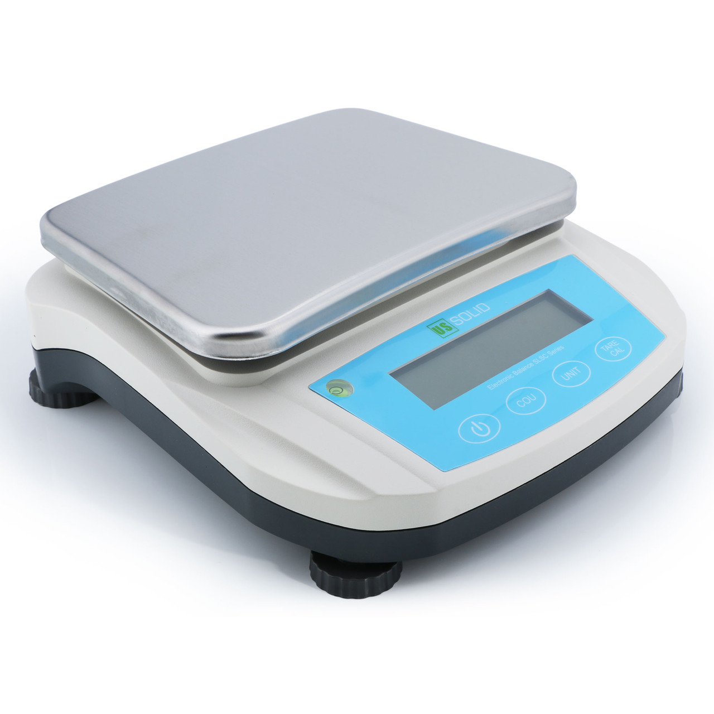

# Context

I got my hands on a [semi-advanced weighing scale](https://ussolid.com/100-x-0-001g-analytical-balance-1-mg-digital-lab-precision-scale.html) but unfortunately, the 'UNIT' button (and part of the display) didn't work, so I couldn't change units on the device. To make things worse, I found out the scale didn't natively support milligrams. I wanted to see if I could use software to remedy these issues...

# About

This program is a wrapper around the RS-232 interface implemented by the USS-DBS Digital Analytical Balance Scale. The scale transmits measurements via RS-232 through a USB B connector on the side. My program listens over the serial port to measurements received, and can:

* convert them to any desired unit
* log the measurements (and the time the measurement was received) to a CSV file
* transmit the measurement as keyboard input via [`uinput`](https://kernel.org/doc/html/v4.12/input/uinput.html), i.e. which allow you to treat the scale as a keyboard

# Installation

The program is written in C++ (since it requires the `uinput` interface) and is built via C-Make.

```bash
$ cmake CMakeLists.txt && make
```

# Usage

```
Usage: ./us_solid_precision_balance_driver
-h 	 	 	 Shows this help text
-u [unit name] 	 	 Measurements will be converted to the specified unit. (See manual for supported unit descriptions)
-o [filename] 	 Logs measurements to the specified CSV file
-k 	 	 	 Prints measurements from the keyboard directly. Only recommended in single-measurement mode (otherwise it'll be noisy)
```

# Output

Here's an example of the output you'll see:

```
[DEBUG] User specified unit: lb
[DEBUG] User requested output to output-file.csv
[DEBUG] Measurement received: 0.676918
[DEBUG] Current Time = Fri Sep 30 22:30:03 2022

[DEBUG] Measurement received: 0.676918
[DEBUG] Current Time = Fri Sep 30 22:30:03 2022
```

A few lines of the CSV file created:

```
'Measurement Time' , 'Measurement Value (Units = g)'
307.72 , Fri Sep 30 22:08:11 2022
307.72 , Fri Sep 30 22:08:11 2022
307.72 , Fri Sep 30 22:08:11 2022
307.72 , Fri Sep 30 22:08:11 2022
```

# Contributing/Notes

The `docs` folder contains information about the format of the data sent by the scale, as well as the product manual.

Note that the scale has 2 modes, a "continuous" mode and a "single-measurement" mode. The continuous mode will poll the scale very rapidly, so be careful using it if you have either the keyboard or output file set.